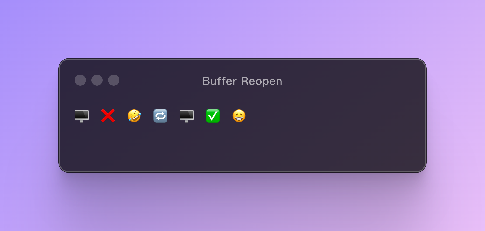

# ⌨️ Buffer Reopen for Nvim

**Buffer Reopen is application for Nvim that allows you to reopen closed buffers with ease.**



## ✨ Features

- Reopen closed buffers with keybindings or command.

## 📦 Installation

### Using Lazyvim

```lua
{
  'iamyoki/buffer-reopen.nvim',
  opts = {}
}
```

### Using Plug

```vim
Plug 'iamyoki/buffer-reopen.nvim'
```

Then run `:PlugInstall` or `:lua require('plug').install('buffer-reopen.nvim')` to install the plugin.

## 🚀 Usage

### Default Keybindings

- `<leader>bt` - Reopen.
- `<C-S-Tab>` - Reopen.

### Commands

- `:BufferHistory reopen` - Reopen.
- `:BufferHistory show_closed` - Show closed buffers.

### Custom Keybindings

You can disable the default keybindings and define your own keybindings for the plugin.

In Lazyvim for example:

```lua
{
  'iamyoki/buffer-reopen.nvim',
  keys = {
    -- disable the default keybindings
    {'<leader>bt', mode={'n'}, false},
    {'<C-S-t>', mode={'n'}, false},
  }
}
```

```lua
-- define your own keybindings
vim.keymap.set('n', '<leader>br', ':BufferHistory reopen<CR>', {silent = true})
```
